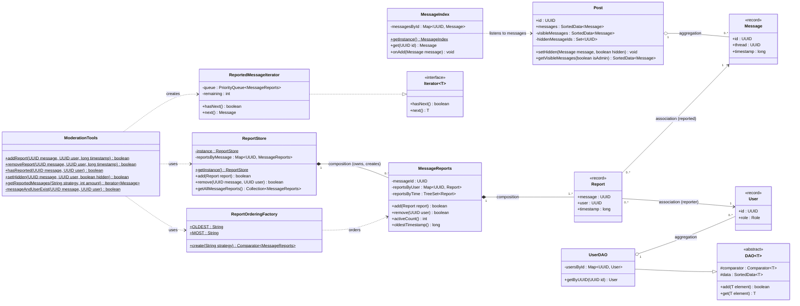
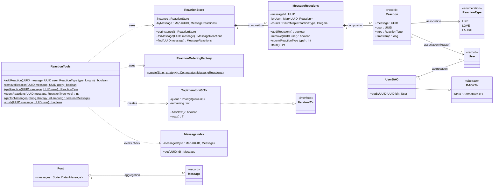

# UML prediction: the group task

> `uml.png` next to this file is the practice-hackathon design below, rendered. Use it to rehearse; tomorrow
> draw **your team's** design, because the marks are for describing your architecture.

## 1. Marking (from the practice hackathon)

| Part | Marks | Requirement |
|---|---|---|
| Minimum content | 50% | at least **5 classes** including the tools class; one **private**, one **protected**, one **public** field; **2 static** and **2 non-static** methods; one each of **composition**, **aggregation**, **association** |
| Usefulness | 50% | shows the new module's architecture; leaves out irrelevant classes; tidy layout |

## 2. Notation cheat sheet

| Thing | UML | Mermaid |
|---|---|---|
| public / private / protected | `+` / `-` / `#` | same |
| static member | underlined | `$` at the end of the line |
| abstract / interface / record | *italic* or `<<abstract>>` / `<<interface>>` | `<<abstract>>` inside the class |
| **Composition** (part cannot exist without the whole; whole creates it) | filled diamond on the whole's side | `Whole *-- Part` |
| **Aggregation** (whole groups parts that live on their own) | hollow diamond on the whole's side | `Whole o-- Part` |
| **Association** (uses / refers to, e.g. holds a UUID of) | plain line, arrow optional | `A --> B` |
| Inheritance | hollow triangle arrow | `Child --|> Parent` |
| Implements interface | dashed line + hollow triangle | `Class ..|> Interface` |
| Dependency (creates / calls) | dashed arrow | `A ..> B` |
| Multiplicity | `1`, `0..*`, `1..*` at each end | `A "1" *-- "0..*" B` |

Quick rule for the three that are marked:
* **Composition:** "if I delete the store, its groups disappear too" (`ReportStore` creates and owns `MessageReports`).
* **Aggregation:** "the post holds messages, but they are separate objects" (`Post` holds `Message`s, `UserDAO` holds `User`s).
* **Association:** "a report *refers to* a user" (it only stores the user's UUID).

## 3. Where each requirement appears in the example

| Requirement | Example |
|---|---|
| 5+ classes incl. tools class | `ModerationTools`, `ReportStore`, `MessageReports`, `Report`, `ReportOrderingFactory`, `ReportedMessageIterator`, `MessageIndex`, `Post`, ... |
| private field | `ReportStore -reportsByMessage` |
| protected field | `DAO #data`, `DAO #comparator` |
| public field | `Post +messages`, `Post +id` |
| 2 static methods | `ModerationTools +addReport(...)`, `ReportStore +getInstance()` (underlined) |
| 2 non-static methods | `MessageReports +add(...)`, `ReportedMessageIterator +next()` |
| composition | `ReportStore *-- MessageReports`, `MessageReports *-- Report` |
| aggregation | `Post o-- Message`, `UserDAO o-- User` |
| association | `Report --> User` (reporter), `Report --> Message` (reported) |
| patterns visible | Factory (`ReportOrderingFactory`), Iterator (`..|> Iterator`), Singleton (`getInstance`), Observer (`MessageIndex` listens) |

## 4. The diagram source (paste into https://mermaid.live, then export PNG)

IntelliJ's Markdown preview also renders Mermaid if the plugin is enabled. Swap names for your team's classes.

## 5. Second example: the reactions prediction (`uml_reactions.png`)

The same shape works for any Task 1 theme: Tools facade -> Store (Singleton) -> per-message group (composition) ->
record (composition) -> association to `User`, Factory + Iterator for Task 4. Requirement check: private `-byUser`,
protected `#data`, public `+message`; static `addReaction`/`getInstance`, non-static `add`/`count`;
composition `ReactionStore *-- MessageReactions`, aggregation `Post o-- Message`, association `Reaction --> User`.

## 6. Fast workflow tomorrow (about 15 minutes)

1. Copy the block above into mermaid.live.
2. Rename classes and methods to your team's design; delete anything not in your code.
3. Tick the table in section 3 against your diagram (every row must have one example).
4. Export PNG, save as `uml.png` in the repo root (replace the provided one), commit and push to `main`.

Drawing by hand also earns full marks: photo it in good light and make sure the `+ - #` and underlines are readable.
