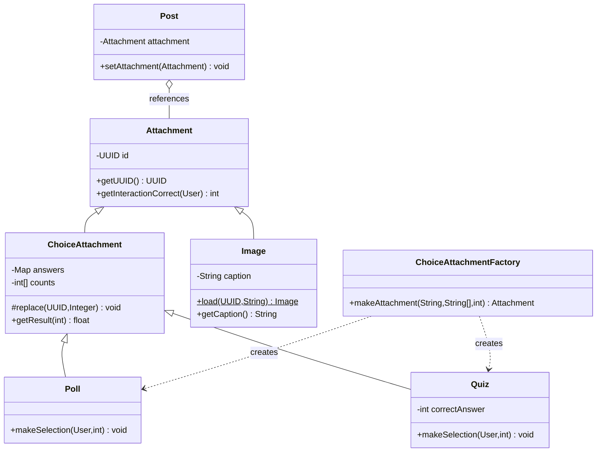

# Task 5 — Code quality, QuizMarker refactor, SOLID, UML

The uploaded `QuizMarker` has unused imports, an irrelevant nested class, repeated full scans of posts, possible null dereferences, integer division, and unclear variable names. This version is designed for the Task 3 shared `ChoiceAttachment` hierarchy.

## Replace `attachments/QuizMarker.java`

```java
package attachments;
import dao.PostDAO;
import dao.UserDAO;
import dao.model.Post;
import dao.model.User;
import java.util.*;

/** Calculates each user's fraction of answered quizzes that were correct. */
public final class QuizMarker {
    // Preserve the original method name and return type for callers.
    protected HashMap<User,Float> execute() {
        HashMap<User,Float> result = new HashMap<>();
        Map<UUID,Integer> attempted = new HashMap<>();
        Map<UUID,Integer> correct = new HashMap<>();

        // One pass through posts instead of one pass per user.
        Iterator<Post> posts = PostDAO.getInstance().getAll();
        while (posts.hasNext()) {
            Attachment attachment = posts.next().getAttachment();
            if (!(attachment instanceof Quiz quiz)) continue; // Null, image, poll ignored.
            for (var answer : quiz.getAnswers().entrySet()) {
                UUID id = answer.getKey();
                attempted.merge(id, 1, Integer::sum);
                if (answer.getValue() == quiz.getCorrectAnswer())
                    correct.merge(id, 1, Integer::sum);
            }
        }
        Iterator<User> users = UserDAO.getInstance().getAll();
        while (users.hasNext()) {
            User user = users.next();
            int total = attempted.getOrDefault(user.getUUID(), 0);
            int wins = correct.getOrDefault(user.getUUID(), 0);
            // Never divide integers and never divide by zero.
            result.put(user, total == 0 ? 0.0f : (float) wins / total);
        }
        return result;
    }
}
```

**Important semantics:** The original `QuizMarker` computes `correct / (numberOfPosts + correct)` using integer division and dereferences every post's attachment. The refactor interprets its *intended* purpose as `correct / attempted quizzes`; that is a **behavior change** beyond purely structural refactoring. The task says to change behavior only to fix a bug. If your marker expects the old formula, agree with your team/TA whether changing the denominator is a justified bug fix. A safer alternative is to keep the original denominator but cast to float and guard null attachments.

## Fix `attachments/Attachment.java`

```java
package attachments;
import dao.model.HasUUID;
import dao.model.User;
import java.util.*;
/** Base type for all attachments. */
public abstract class Attachment implements HasUUID {
    private final UUID id;
    protected Attachment(UUID id) { this.id = Objects.requireNonNull(id); }
    @Override public final UUID getUUID() { return id; }
    // Sentinel: not a quiz or user has not answered.
    public int getInteractionCorrect(User user) { return -1; }
}
```

`Quiz` overrides `getInteractionCorrect(User)` to return 1 if correct, 0 if incorrect, -1 if unanswered. The original implementation returning `7777` is a deliberate stub/bug.

## `solid-questions.txt` — answers under 75 words each

**Liskov substitution principle:**

> `Poll`, `Quiz`, and `Image` extend `Attachment`, so a `Post` can hold any of them through its `Attachment` field. Code that only needs the attachment's UUID can use any subtype without knowing which concrete class it received. Each subtype preserves the common `getUUID()` contract, while subtype-specific voting behavior remains within the appropriate classes.

**Dependency inversion principle:**

> `DataPipeline` depends on the `Serializer<T,S>` interface and factory abstractions rather than a particular poll, quiz, or image storage format. Our new attachment and response serializers implement that interface, so the persistence pipeline can process them without being rewritten for each attachment type. High-level persistence coordination relies on the serialization abstraction, while the concrete serializers supply the details.

## Suggested UML (textual blueprint)



This is a **blueprint**, not a guaranteed complete rubric diagram. For the required UML, explicitly show one composition (e.g. `ChoiceAttachment` owns its private counts array), one aggregation (`Post` references a shareable `Attachment`), one association (factory creates choice attachments), **two static methods** (e.g. `Image.load` and `PostDAO.getInstance`), two instance methods, and public/protected/private fields. Note: the recommended encapsulated design mostly uses private fields; if your UML needs public/protected fields, show relevant existing classes (e.g. `Post.id` public and `DAO.data` protected), rather than exposing internals just to satisfy the diagram.

## Code-review checklist

- All new classes compile against one agreed constructor/API design.
- All exceptions have meaningful types and messages.
- No `return 7777`, `return -1` placeholders, or TODO methods remain.
- No quadratic scan per voter or full scan per `getResult`.
- Defensive copies for option arrays; UUID identity is stable across persistence.
- Save/load tests include shared images, null attachments, Unicode, duplicate quiz votes, and invalid indices.
- Review `ComputerIOFactory` date gate and `CSVReader.hasNext()` before claiming persistence works.

**Status:** Suggested refactor and architecture; not yet validated against the complete application or the marking environment.
