# UML: Moderation tools architecture

This diagram shows the classes added or changed for the hackathon (Tasks 1 to 4) and the existing classes they connect to. Fields and methods unrelated to moderation are left out. The submitted image version is `uml.png`.

```mermaid
classDiagram
direction TB

class ModerationTools {
  +addReport(UUID message, UUID user, long timestamp)$ boolean
  +removeReport(UUID message, UUID user, long timestamp)$ boolean
  +hasReported(UUID message, UUID user)$ boolean
  +setHidden(UUID message, UUID user, boolean hidden)$ boolean
  +getReportedMessages(String strategy, int amount)$ Iterator~Message~
  -findMessage(ReportStore store, UUID message)$ Message
}

class ReportStore {
  -ReportStore instance$
  -Map~UUID,MessageReports~ reportsByMessage
  +getInstance()$ ReportStore
  +add(Message message, UUID user, long timestamp) boolean
  +remove(UUID message, UUID user) boolean
  +hasReported(UUID message, UUID user) boolean
  +get(UUID message) MessageReports
  +getAll() Collection~MessageReports~
  +getAllReports() Iterator~Report~
  +clear() void
}

class MessageReports {
  -Message message
  -Map~UUID,Report~ reportsByUser
  +add(UUID user, long timestamp) boolean
  +remove(UUID user) boolean
  +hasReportFrom(UUID user) boolean
  +count() int
  +oldestTimestamp() long
  +getMessage() Message
}

class Report {
  <<record>>
  +UUID message
  +UUID user
  +long timestamp
}

class ReportOrderingFactory {
  +String OLDEST$
  +String MOST$
  -ReportOrderingFactory()
  +create(String strategy)$ Comparator~MessageReports~
}

class ReportedMessageIterator {
  -List~MessageReports~ ranked
  -int limit
  -int index
  +hasNext() boolean
  +next() Message
}

class Iterator~Message~ {
  <<interface>>
  +hasNext() boolean
  +next() Message
}

class Post {
  +UUID id
  +SortedData~Message~ messages
  -Set~UUID~ hiddenMessageIds
  +setHidden(UUID messageId, boolean hidden) void
  +isHidden(UUID messageId) boolean
  +getHiddenMessageIds() Set~UUID~
  +getVisibleMessages(boolean isAdmin) SortedData~Message~
}

class Message {
  <<record>>
  +UUID id
  +UUID thread
  +long timestamp
  +String message
}

class User {
  <<record>>
  +UUID id
  +Role role
}

class DAO~T~ {
  <<abstract>>
  #Comparator~T~ comparator
  #SortedData~T~ data
  +get(T element) T
  +getAll() Iterator~T~
}

class PostDAO {
  +getInstance()$ PostDAO
  +getMessageByUUID(UUID id) Message
  +getAllHiddenMessages() Iterator~HiddenMessage~
}

class UserDAO {
  +getInstance()$ UserDAO
  +getByUUID(UUID id) User
}

class HiddenMessage {
  <<record>>
  +UUID post
  +UUID message
}

class DataManager {
  -DataPipeline reportPipeline
  -DataPipeline hiddenPipeline
  +readAll() void
  +writeAll() void
}

class ReportSerializer {
  +int COLUMN_COUNT$
  +serialize(Report report) String[]
  +deserialize(String[] data) Report
}

class HiddenMessageSerializer {
  +int COLUMN_COUNT$
  +serialize(HiddenMessage hidden) String[]
  +deserialize(String[] data) HiddenMessage
}

%% Composition: the whole owns its parts; parts are deleted with it
ReportStore "1" *-- "0..*" MessageReports : owns
MessageReports "1" *-- "1..*" Report : owns
Post "1" *-- "0..*" Message : owns

%% Aggregation: refers to objects that live independently
MessageReports "0..1" o-- "1" Message : refers to

%% Association: uses another class through a reference
ModerationTools --> ReportStore : stores reports
ModerationTools --> UserDAO : checks users
ModerationTools --> PostDAO : finds messages
ReportedMessageIterator --> MessageReports : ranks
DataManager --> ReportStore : saves / loads
DataManager --> PostDAO : saves / loads

%% Dependency: creates or uses temporarily
ModerationTools ..> ReportOrderingFactory : gets ordering
ModerationTools ..> ReportedMessageIterator : creates
ReportOrderingFactory ..> MessageReports : compares
PostDAO ..> HiddenMessage : creates
DataManager ..> ReportSerializer : uses
DataManager ..> HiddenMessageSerializer : uses
ReportSerializer ..> Report : converts
HiddenMessageSerializer ..> HiddenMessage : converts

%% Inheritance and realisation
PostDAO --|> DAO
UserDAO --|> DAO
ReportedMessageIterator ..|> Iterator
PostDAO "1" o-- "0..*" Post : stores
UserDAO "1" o-- "0..*" User : stores
```

## How to read it

| Symbol | Meaning | Example in this diagram |
|---|---|---|
| `+` | public | `Post.id` (public field) |
| `-` | private | `ReportStore.reportsByMessage` (private field) |
| `#` | protected | `DAO.data` (protected field) |
| underlined | static | `ModerationTools.addReport`, `ReportOrderingFactory.create` |
| filled diamond ◆ | **composition**: the part can't exist without the whole | `ReportStore` ◆ `MessageReports`: when the last report is removed, the store deletes the entry |
| hollow diamond ◇ | **aggregation**: the part exists independently | `MessageReports` ◇ `Message`: the message still exists in its post if the reports go |
| solid arrow → | **association**: holds or uses a reference | `ModerationTools` → `ReportStore` |
| dashed arrow ⇢ | dependency: creates or uses briefly | `ModerationTools` ⇢ `ReportOrderingFactory` |
| hollow triangle ▷ (solid line) | inheritance (`extends`) | `PostDAO` ▷ `DAO` |
| hollow triangle ▷ (dashed line) | realisation (`implements`) | `ReportedMessageIterator` ▷ `Iterator` |

## Requirement checklist

| Requirement | Where |
|---|---|
| At least 5 classes, including `ModerationTools` | 18 classes, `ModerationTools` on the left |
| A private field | `ReportStore.reportsByMessage`, `Post.hiddenMessageIds` |
| A protected field | `DAO.comparator`, `DAO.data` |
| A public field | `Post.id`, `Post.messages`, `ReportOrderingFactory.OLDEST` |
| Two static methods | `ModerationTools.addReport`, `ReportOrderingFactory.create`, `ReportStore.getInstance` |
| Two non-static methods | `ReportStore.add`, `MessageReports.count`, `Post.getVisibleMessages` |
| Composition | `ReportStore` ◆ `MessageReports`, `MessageReports` ◆ `Report`, `Post` ◆ `Message` |
| Aggregation | `MessageReports` ◇ `Message`, `PostDAO` ◇ `Post`, `UserDAO` ◇ `User` |
| Association | `ModerationTools` → `ReportStore`, `ModerationTools` → `UserDAO`, `ReportedMessageIterator` → `MessageReports` |

## What each part does

**Task 1, reporting.** `ModerationTools` checks the user and message exist, then stores the report in `ReportStore`. That's a singleton holding a `HashMap` from message UUID to `MessageReports`. Each `MessageReports` holds one message and a `HashMap` from user UUID to `Report`. Every add, remove and lookup is O(1). A message's entry is deleted when its last report is removed.

**Task 2, hiding.** Each `Post` keeps a private `HashSet` of hidden message UUIDs. `setHidden` checks the user is an Admin. `getVisibleMessages(false)` builds a filtered `SortedData` that leaves out hidden messages; admins get every message. Hiding never touches reports.

**Task 3, persistence.** `DataManager` saves two extra CSV files: `reports.txt` (message, user, timestamp) and `hidden_messages.txt` (post, message). It uses `ReportSerializer` and `HiddenMessageSerializer` in the existing pipeline. Load order: users, posts, messages, hidden messages, reports.

**Task 4, viewing reports.**
- **Factory pattern:** `ReportOrderingFactory.create("OLDEST" | "MOST")` returns the matching `Comparator`, or throws for anything else.
- **Iterator pattern:** `ReportedMessageIterator` implements `Iterator<Message>`. It sorts a snapshot of the reported messages and hands out at most `amount` of them.

**Singletons:** `ReportStore`, `PostDAO`, `UserDAO` and `DataManager` each have a static `getInstance()`.
